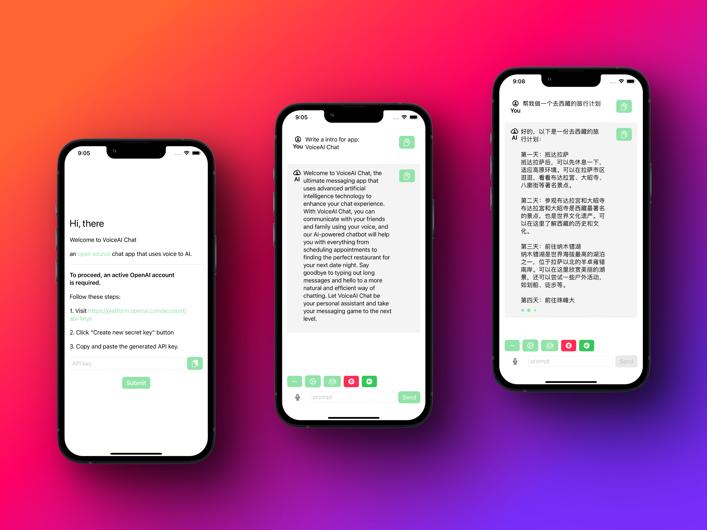
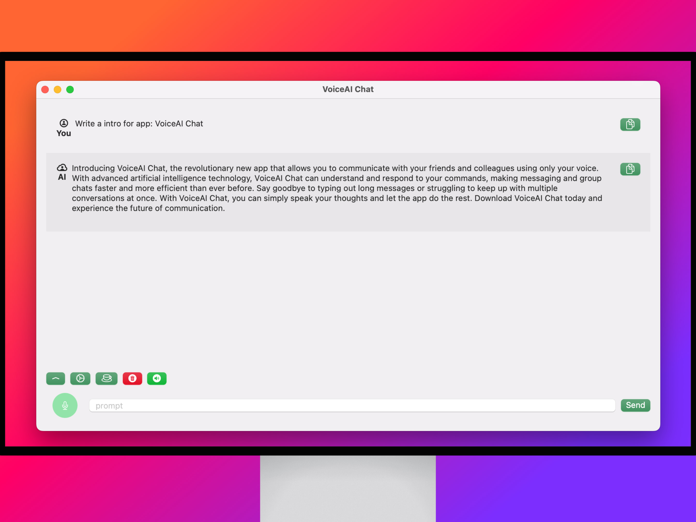

# OpenAISwiftUI

A chat app use OpenAI API and SwiftUI.

[Download on the App Store](https://apps.apple.com/app/id6445994863) 

## Useage

Input your [API key](https://platform.openai.com/account/api-keys) first.

Here is the Demo video https://www.youtube.com/shorts/qpxkTroEcOY

## Thanks

Use SDK [adamrushy/OpenAISwift](https://github.com/adamrushy/OpenAISwift)

Use SDK [alfianlosari/ChatGPTSwift](https://github.com/alfianlosari/ChatGPTSwift)
